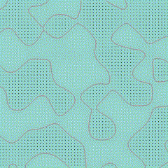

# Marching Squares

An OpenGL implementation of the Marching Squares algorithm for drawing contours.

## Demo

[](https://youtu.be/9HluleYXrGw)

## Details

Using [Perlin's improved noise](https://cs.nyu.edu/~perlin/noise/) to provide a scalar field $f(x, y, t)$ that changes with time, we use Marching Squares at each frame $t$ to draw the contour $f(x, y) = 0$.

## ~~How to Run~~ How I Make It Run

Using CMake, I was able to make the program run on Windows and Ubuntu.

### Ubuntu

Navigate to `.../marching-squares/` in the terminal. Run the following commands:

```
$ mkdir build
$ cd build
$ cmake ..
$ make
$ cd ..
$ ./build/marching-squares
```

### Windows (Visual Studio + vcpkg)

Making it run on Windows was not fun. But I did it and now I can use Visual Studio so it was worth it. Hopefully these steps work for you; if not, sorry :(

1. Install [Visual Studio](https://visualstudio.microsoft.com/), [CMake](https://cmake.org/download/), and [vcpkg](https://vcpkg.io/en/index.html). Navigate to the directory where you installed vcpkg, `.../vcpkg/`, and install the necessary dependencies, which *\*should\** only be `glfw3`:

```
> vcpkg install glfw3:x64-windows
```

2. Add the environment variable `CMAKE_TOOLCHAIN_FILE` with value `.../vcpkg/scripts/buildsystems/vcpkg.cmake`.

3. Navigate to the `.../marching-squares/` directory and run

```
> cmake-gui .
```

4. Set the build directory to `.../marching-squares/build/`, and press `Configure`. Allow CMake to create the build directory. Set the generator to your Visual Studio version and use default native compilers, then press `Finish`. Press `Configure` again, then `Generate`.

5. Now, in `.../marching-squares/build/`, you should see `marching-squares.sln`. Open it and run the program. You should see a window open up with the Marching Squares!

## Todo

- [x] add CMake support
- [ ] refactor 'global' variables (e.g. `window_width`, `window_height`)
